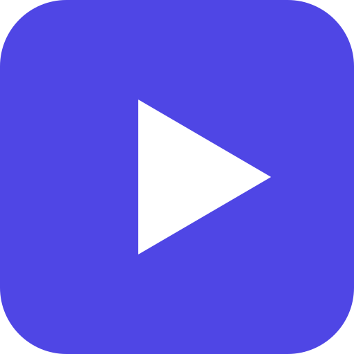

<p align="center">
  
</p>

<h1 align="center">TIVIFY</h1>

<p align="center">
  <strong>Self-hosted IPTV &amp; VOD streaming platform</strong><br>
  Live TV, Video on Demand, Series, EPG, and a native Android client — all in one.
</p>

<p align="center">
  <a href="#features">Features</a> •
  <a href="#tech-stack">Tech Stack</a> •
  <a href="#architecture">Architecture</a> •
  <a href="#quick-start">Quick Start</a> •
  <a href="#android-app">Android</a> •
  <a href="#api">API</a> •
  <a href="#contributing">Contributing</a>
</p>

<p align="center">
  
  
  
  
  
  
</p>

<p align="center">
  
</p>

---

> **Vibecoded** — This project was built with significant AI assistance using [Claude](https://claude.ai) by Anthropic. The architecture, backend, frontend, Android app, and infrastructure were developed through an iterative human-AI collaboration process. Every line of code was reviewed and validated, but the DNA of this project is vibecoded through and through.

---

## Features

### Live TV & Streaming
- Import channels from **M3U/IPTV** sources or create them manually
- **HLS, RTMP, and MPEG-TS** stream support
- Multiple fallback streams per channel
- **Live emissions** — broadcast local media as live channels using FFmpeg
- **Electronic Program Guide (EPG)** with XMLTV import

### Video on Demand
- Upload local video files (**up to 10 GB** per file)
- **Automatic HLS transcoding** via FFmpeg with progress tracking
- **TMDB enrichment** — auto-fetch metadata, posters, and backdrops
- **Continue watching** — resume playback across devices

### Series & Episodes
- Organize VODs into series with **seasons and episodes**
- Series-level TMDB metadata enrichment
- Full catalog browsing with search and filters

### Library Scanner
- **Scan external drives/folders** for media files
- Bulk import with automatic TMDB matching
- Smart folder structure recognition (series/season/episode detection)

### User Management
- **Role-based access** — admin and user roles
- Account expiration and connection limits
- Per-user **favorites** and **watch history**
- Secure authentication with JWT + refresh tokens

### Xtream Codes API
- Compatible endpoints for **third-party IPTV players**
- `player_api.php`, `xmltv.php`, live/movie/series routes
- Drop-in replacement for Xtream Codes servers

### Remote Access
- Built-in **Tailscale VPN** integration
- Automatic TLS certificates
- Access your server securely from anywhere

### Android App
- **Native Kotlin/Jetpack Compose** application
- **ExoPlayer** for HLS video playback
- **D-pad and remote control** support for Android TV
- Multi-server management (save up to 10 servers)
- Optimized layouts for phones, tablets, and TVs
- **APK distribution** directly from the server

### Admin Dashboard
- System statistics and overview
- Full CRUD management for channels, VOD, series, categories, EPG, and users
- IPTV import from M3U URLs
- Media upload with transcoding monitoring
- Library scanner with TMDB integration
- Tailscale VPN status and control

---

## Tech Stack

| Layer | Technology | Purpose |
|-------|-----------|---------|
| **Backend** | Go 1.22, Fiber v2, GORM | REST API, business logic, transcoding |
| **Database** | PostgreSQL 16 | Primary data store (16 tables) |
| **Cache** | Redis 7 | Session cache, general caching |
| **Frontend** | Next.js 14, React 18, Tailwind CSS | Server-rendered web application |
| **Android** | Kotlin 2.0, Jetpack Compose, Hilt, ExoPlayer | Native mobile/TV client |
| **Streaming** | FFmpeg, HLS | Video transcoding and live broadcasting |
| **Proxy** | Nginx | Reverse proxy, rate limiting, media serving |
| **Infrastructure** | Docker Compose | Container orchestration |
| **VPN** | Tailscale | Encrypted remote access |

---

## Architecture

```
┌─────────────────┐    ┌─────────────────┐    ┌──────────────────┐
│   Android App   │    │   Next.js Web   │    │  Xtream Codes    │
│  (Kotlin/Compose)│    │   (React 18)    │    │    Clients       │
└────────┬────────┘    └────────┬────────┘    └────────┬─────────┘
         │                      │                      │
         └──────────┬───────────┴──────────────────────┘
                    │  HTTPS / HTTP
             ┌──────┴──────┐
             │    Nginx    │  Reverse proxy, rate limiting,
             │   :80/443   │  media serving, stream auth
             └──────┬──────┘
                    │
             ┌──────┴──────┐
             │   Backend   │  Go/Fiber REST API
             │    :8080    │  16 handlers, 16 services
             └──┬───────┬──┘
                │       │
         ┌──────┴──┐ ┌──┴──────┐
         │Postgres │ │  Redis  │
         │  :5432  │ │  :6379  │
         └─────────┘ └─────────┘
```

The backend follows a clean **layered architecture**:

```
Handler (HTTP) → Service (business logic) → Repository (data access) → Database
```

- **16 Handlers** — parse requests, validate input, return JSON
- **16 Services** — business logic, transcoding, IPTV import, TMDB enrichment
- **14 Repositories** — GORM-based data access with pagination
- **16 Database Models** — users, channels, VODs, series, EPG, and more

For detailed architecture documentation, see [docs/ARCHITECTURE.md](docs/ARCHITECTURE.md).

---

## Quick Start

### Prerequisites

- [Docker](https://docs.docker.com/get-docker/) and Docker Compose
- *(Optional)* Node.js 18+ and Go 1.22+ for local development

### Production (Docker Compose)

```bash
# 1. Clone the repository
git clone https://github.com/YOUR_USERNAME/tivify.git
cd tivify

# 2. Configure environment
cp .env.example .env
```

Edit `.env` and change **at minimum**:

| Variable | What to change |
|----------|---------------|
| `DB_PASSWORD` | Strong database password |
| `REDIS_PASSWORD` | Strong Redis password |
| `JWT_SECRET` | Random string, 32+ characters |
| `ADMIN_PASSWORD` | Admin account password |

```bash
# 3. Start all services
make up

# 4. Open http://localhost and log in with admin credentials
```

### Development

```bash
# Start infrastructure only (PostgreSQL + Redis)
make dev-up

# In separate terminals:
make backend-dev     # Go backend with hot reload on :8080
make frontend-dev    # Next.js dev server on :3000
```

### Available Make Commands

| Command | Description |
|---------|------------|
| `make up` | Start all services (production) |
| `make down` | Stop all services |
| `make build` | Build all Docker images |
| `make dev-up` | Start PostgreSQL + Redis (development) |
| `make dev-down` | Stop development services |
| `make backend-dev` | Run Go backend with hot reload |
| `make frontend-dev` | Run Next.js dev server |
| `make logs` | Follow logs from all services |
| `make logs-backend` | Follow backend logs only |

See [docs/DEVELOPMENT.md](docs/DEVELOPMENT.md) for the full development setup guide.

---

## Project Structure

```
tivify/
├── backend/                # Go/Fiber REST API
│   ├── cmd/server/         #   Entry point (main.go)
│   └── internal/           #   Config, models, repos, services, handlers, middleware
├── frontend/               # Next.js 14 web application
│   └── src/
│       ├── app/            #   Pages (App Router) — user, admin, auth
│       ├── components/     #   Reusable UI components
│       ├── context/        #   Auth & toast providers
│       └── lib/            #   API client, types, utilities
├── android/                # Native Android app (Kotlin/Compose)
│   └── app/src/main/java/com/tivify/app/
│       ├── ui/             #   Compose screens (splash, login, home, player, ...)
│       ├── data/           #   API client, models, DTOs
│       ├── util/           #   TokenManager, constants
│       └── di/             #   Hilt dependency injection
├── docker/                 # Docker Compose configuration
│   └── docker-compose.yml  #   All service definitions
├── nginx/                  # Nginx reverse proxy config
│   ├── nginx.conf          #   Main config (gzip, rate limits, security)
│   └── conf.d/default.conf #   Virtual server (routing, caching, auth)
├── docs/                   # Documentation
│   ├── ARCHITECTURE.md     #   System design & data flows
│   ├── API.md              #   REST API reference
│   ├── DEPLOYMENT.md       #   Production deployment guide
│   ├── DEVELOPMENT.md      #   Local development setup
│   └── ANDROID.md          #   Android app build & features
├── scripts/                # Build and validation scripts
├── .github/workflows/      # CI/CD (APK build & release)
├── VERSION                 # Semantic version (source of truth)
├── Makefile                # Dev/build commands
├── .env.example            # Environment variables template
└── LICENSE                 # MIT
```

---

## Android App

The Android client is a native **Kotlin/Jetpack Compose** application supporting phones, tablets, and Android TV.

### Key Technologies
- **Jetpack Compose** — declarative UI with Material 3
- **Hilt** — dependency injection
- **ExoPlayer (Media3)** — HLS video playback
- **Retrofit + OkHttp** — API communication
- **DataStore** — encrypted token persistence
- **Coil** — image loading

### Screens
- **Splash** — animated launch screen
- **Login** — with saved servers and quick account switching
- **Home** — continue watching + featured content
- **Channels** — live TV grid with category filters
- **VOD** — movie catalog with search and pagination
- **Series** — series catalog with season/episode browsing
- **Player** — fullscreen ExoPlayer with D-pad/remote controls
- **Favorites & History** — per-user bookmarks and watch history
- **EPG** — electronic program guide
- **Profile** — settings and account management

### APK Releases

Pre-built APKs are available in the [Releases](../../releases) page, automatically built via GitHub Actions on every version tag.

For manual builds, see [docs/ANDROID.md](docs/ANDROID.md).

---

## API

The backend exposes a comprehensive REST API at `/api/v1/`:

### Public
| Method | Endpoint | Description |
|--------|----------|-------------|
| `POST` | `/auth/login` | Authenticate user |
| `POST` | `/auth/refresh` | Refresh access token |
| `POST` | `/auth/logout` | End session |

### User (authenticated)
| Method | Endpoint | Description |
|--------|----------|-------------|
| `GET` | `/channels` | List active channels |
| `GET` | `/vod` | List VOD catalog |
| `GET` | `/series` | List series catalog |
| `GET` | `/categories` | List categories |
| `GET` | `/epg` | Get program guide |
| `GET/POST` | `/favorites/*` | Manage favorites |
| `GET/POST` | `/history/*` | Watch history & continue watching |
| `GET` | `/search` | Global search |

### Admin (admin role required)
| Scope | Endpoints | Operations |
|-------|-----------|-----------|
| Dashboard | `/admin/dashboard/stats` | System statistics |
| Channels | `/admin/channels/*` | CRUD + stream management |
| VOD | `/admin/vod/*` | CRUD + TMDB enrichment |
| Series | `/admin/series/*` | CRUD + TMDB enrichment |
| Categories | `/admin/categories/*` | CRUD |
| Users | `/admin/users/*` | CRUD |
| EPG | `/admin/epg/*` | CRUD |
| Media | `/admin/media/*` | Upload + transcoding |
| Library | `/admin/library/*` | Scan + import |
| IPTV | `/admin/iptv/*` | M3U import |
| Emissions | `/admin/channels/:id/emission/*` | Live broadcasting |
| Tailscale | `/admin/tailscale/*` | VPN management |

### Xtream Codes Compatibility
| Endpoint | Description |
|----------|-------------|
| `/player_api.php` | Player API (GET/POST) |
| `/xmltv.php` | EPG in XMLTV format |
| `/live/:user/:pass/:id` | Live stream access |
| `/movie/:user/:pass/:id` | VOD stream access |
| `/series/:user/:pass/:id` | Series stream access |

For the complete API reference, see [docs/API.md](docs/API.md).

---

## Docker Services

| Service | Image | Purpose | Port |
|---------|-------|---------|------|
| **postgres** | `postgres:16-alpine` | Primary database | 5432 |
| **redis** | `redis:7-alpine` | Cache & sessions | 6379 |
| **backend** | Custom (Go) | REST API server | 8080 |
| **frontend** | Custom (Next.js) | Web application | 3000 |
| **nginx** | Custom | Reverse proxy | 80, 443 |
| **tailscale** | Custom | VPN access | — |

All services include health checks, resource limits, and automatic restart policies.

---

## CI/CD

### Automatic APK Builds

This project uses **GitHub Actions** to automatically build the Android APK and publish it as a release:

- **On version tags** (`v*`) — builds the APK, creates a GitHub Release, and attaches the APK
- **Manual trigger** — run the workflow from the Actions tab at any time

To create a new release:

```bash
# 1. Update version
echo "2.5.0" > VERSION

# 2. Increment versionCode in android/app/build.gradle.kts

# 3. Commit, tag, and push
git add -A
git commit -m "Release v2.5.0"
git tag v2.5.0
git push origin main --tags
```

The APK will appear in the [Releases](../../releases) page within minutes.

---

## Documentation

| Document | Description |
|----------|-------------|
| [Architecture](docs/ARCHITECTURE.md) | System design, components, data flows, security model |
| [API Reference](docs/API.md) | Complete REST API endpoint documentation |
| [Deployment](docs/DEPLOYMENT.md) | Production deployment and configuration guide |
| [Development](docs/DEVELOPMENT.md) | Local development environment setup |
| [Android App](docs/ANDROID.md) | Mobile app build process and features |

---

## Security

- **JWT authentication** with short-lived access tokens (15 min) and HttpOnly refresh cookies (7 days)
- **bcrypt** password hashing
- **Rate limiting** — 5 req/min on auth, 30 req/s on API
- **Nginx stream auth** — `auth_request` validates tokens for media access
- **CORS** origin validation
- **Security headers** — CSP, HSTS, X-Frame-Options, Permissions-Policy
- **Input validation** — URL validation (SSRF prevention), length limits, type checks
- **Role-based access** — admin middleware on privileged routes

> **Important:** Always change the default credentials in `.env` before deploying to production. See `.env.example` for all configurable values.

---

## Contributing

Contributions are welcome! Please see [CONTRIBUTING.md](CONTRIBUTING.md) for guidelines.

1. Fork the repository
2. Create a feature branch (`git checkout -b feature/amazing-feature`)
3. Commit your changes (`git commit -m 'Add amazing feature'`)
4. Push to the branch (`git push origin feature/amazing-feature`)
5. Open a Pull Request

---

## Acknowledgments

This project was **vibecoded** with [Claude](https://claude.ai) by Anthropic — an exercise in human-AI collaborative software development. The entire stack (Go backend, Next.js frontend, Kotlin Android app, Docker infrastructure, nginx configuration, and CI/CD pipeline) was developed through iterative prompting and refinement.

**Tools used in development:**
- [Claude Code](https://claude.ai/code) — AI-assisted development
- [Claude](https://claude.ai) — Architecture design, code generation, debugging

---

## License

This project is licensed under the MIT License — see the [LICENSE](LICENSE) file for details.

---

<p align="center">
  <sub>Built with vibes and AI</sub>
</p>
